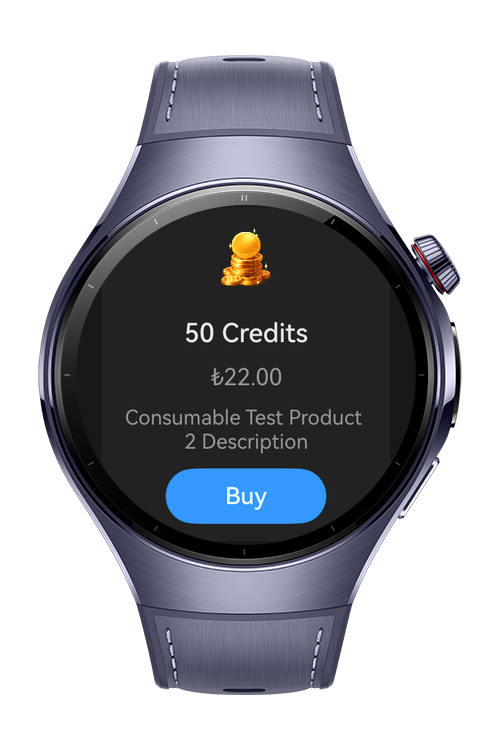
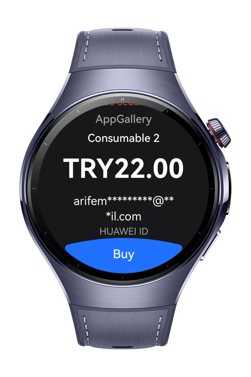
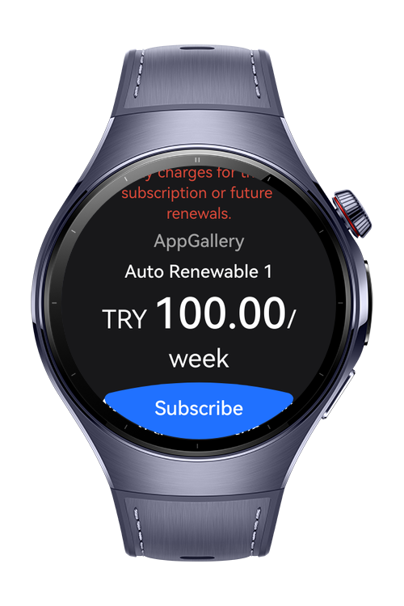
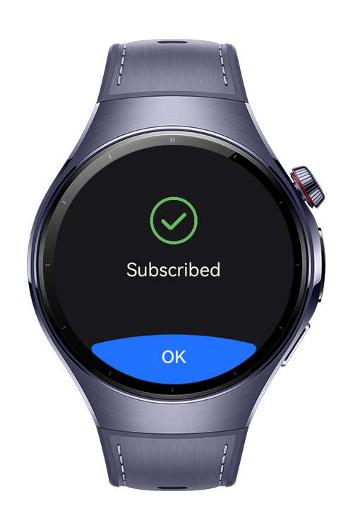

> **Note:** To access all shared projects, get information about environment setup, and view other guides, please visit [Explore-In-HMOS-Wearable Index](https://github.com/Explore-In-HMOS-Wearable/hmos-index).

# In App Purchase (IAP) Order / Subscription Application

IapOrderApp is a sample HarmonyOS application designed to demonstrate In-App Purchase (IAP) flows on Huawei wearable devices.
The app showcases how to manage consumable products, non-consumable products, auto-renewable subscriptions, non-renewing subscriptions, and purchase history using a clean MVVM-based architecture.

This project is intended as a reference implementation for developers who want to integrate Huawei IAP Kit into real-world HarmonyOS applications, especially for watch form factors.

# Preview

<div>    
  
  
  
  
</div> 

# Use Cases

- Display and purchase consumable products (e.g. credits, tokens)

- Unlock non-consumable features (e.g. Remove Ads)

- Manage auto-renewable subscriptions (weekly, yearly, lifetime)

- Handle non-renewing subscriptions (passes)

- Restore and display purchase history

- Demonstrate best practices for:

- Purchase lifecycle handling

- Error handling and user feedback on wearable UI

- Separation of business logic and UI (BasePurchaseViewModel)

# Technology
## Stack
- **Languages**: ArkTS, ARKUI
- **Frameworks**: HarmonyOS SDK 5.1.0(API 18)
- **Tools**: DevEco Studio Vers 5.1.0.842
- **Libraries**:
    - @kit.ArkUI
    - @kit.ArkTS
    - @kit.AbilityKit 
    - @kit.IAPKit
    - @kit.PerformanceAnalysisKit
 
## Required Permissions
- `ohos.permission.INTERNET`

# Directory Structure

````
├───AppScope
│   └───resources
│       └───base
│           ├───element
│           └───media
├───core
│   └───base
│   │    └───BasePurchaseViewModel
│   │  
│   └───iap
│   │    └───IapManager
│   │ 
│   └───navigation
│   │    └───NavigationManager
│   │    └───NavigationConstants
│   │ 
│   └───utils
│        └───AbilityContextProvider
│        └───JwsUtil
│        └───ProductManager
│ 
├───uikit
│   │ 
│   └───components
│       └───ProductCard
│       └───ProductListComponent
│       └───ProductPageBody
│       └───ProductsBody
│       └───ProductTitle
│ 
├───feature
│   └───splash
│   │   └───state
│   │   │      └───ISplashState
│   │   │      └───SplashState
│   │   └───view
│   │   │      └───SplashView
│   │   └───viewModel
│   │          └───SplashViewModel
│   │ 
│   └───consumable
│   │    └───state
│   │    │      └───IConsumableState
│   │    │      └───ConsumableState
│   │    └───view
│   │    │      └───ConsumableView
│   │    └───viewModel
│   │           └───ConsumableViewModel
│   │ 
│   └───history
│   │    └───state
│   │    │      └───IHistoryState
│   │    │      └───HistoryState
│   │    └───view
│   │    │      └───HistoryView
│   │    └───viewModel
│   │           └───HistoryViewModel
│   │ 
│   └───menu
│   │   └───state
│   │   │      └───IMenuState
│   │   │      └───MenuState
│   │   └───view
│   │   │      └───MenuView
│   │   └───viewModel
│   │          └───MenuViewModel
│   │ 
│   └───nonconsumable
│   │   └───state
│   │   │      └───INonConsumableState
│   │   │      └───NonConsumableState
│   │   └───view
│   │   │      └───NonConsumableView
│   │   └───viewModel
│   │          └───NonConsumableViewModel
│   │ 
│   └───subsauto
│   │   └───state
│   │   │      └───ISubsAutoState
│   │   │      └───SubsAutoState
│   │   └───view
│   │   │      └───SubsAutoView
│   │   └───viewModel
│   │          └───SubsAutoViewModel
│   │ 
│   └───subsnonauto
│       └───state
│       │      └───ISubsNonAutoState
│       │      └───SubsNonAutoState
│       └───view
│       │      └───SubsNonAutoView
│       └───viewModel
│              └───SubsNonAutoViewModel
│      
├───entry
│   └───src
│       └───main
│           └───ets
│           │   └───pages 
│           │       └───Index
│           │ 
│           └───resources
│                └───base
│                   └───element
│                   └───media
│                   └───profile
````

# Constraints and Restrictions
## Suported Devices

- Huawei Watch 5

- On HarmonyOS 6.0 wearable devices, only a subset of Huawei IAP Kit features is supported.

## Supported on Watch

✔️ Consumable products

✔️ Non-consumable products

✔️ Auto-renewable subscriptions

✔️ Non-renewing subscriptions

✔️ Purchase history query

✔️ Sandbox testing

## Not Supported on Watch

The following IAP features are not available on wearable devices and must be handled via a mobile companion application:

❌ Managed Subscriptions UI

showManagedSubscriptions() is not supported

Subscription management (upgrade, downgrade, cancel) must be done on phone

❌ Refund Operations

Refund requests and refund status handling are not supported

Users must request refunds via:

Huawei AppGallery

Mobile application

Huawei account services

This demo application focuses on watch-side purchase flows and intentionally excludes unsupported features to match real-world wearable constraints.

# LICENSE

Iap Purchase Subscription App is distributed under the terms of the MIT License.
See the [LICENSE](/LICENSE) for more information.

